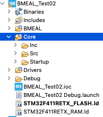

# BME Abstraction Layer (BMEAL) Driver

- BMEAL의 폴더의 위치(새로운 폴더를 생성하고, 하위 폴더를 복사하여 넣는다)   


- BMEAL을 사용하는 방법은 main.c에서 다름과 같이 include한다.
 
```c     
#include "main.h"
#include "../../BMEAL/SEVEN_SEGMENTS/SEVEN_SEGMENTS.h"
void SystemClock_Config(void);
static void MX_GPIO_Init(void);
 
int main(void)
{
    HAL_Init();
    SystemClock_Config();
    MX_GPIO_Init();
 
    SEVEN_SEG_Init(0);
    SEVEN_SEG_Enable(0);
    SEVEN_SEG_Write(0, 0);
 
    while (1)
    {
 
    }
}
```
